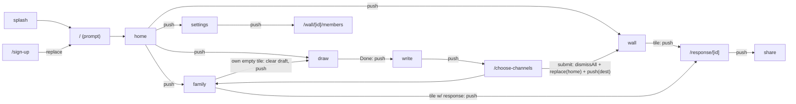

# Scribl UX flow spec — corrected user journeys

Status: implementation contract for the `scribl-ux-flow-review` branch.
Owner: flow-review assessment (Fable). This document is the wireframe-level
source of truth for screens, transitions, what each tap does, and the
back-stack. Reviewers: if the app disagrees with this doc, the app is wrong.

## 1. Purpose & scope

Fixes five reported UX bugs (crayon thumbnails, tap-opens-edit, saved text not
shown, broken back-nav, square avatar), one latent server bug (second submit to
a new channel silently dropped), and adds: real comments, an original/enhanced
image toggle (default enhanced), and web voice→transcript captions.

Non-negotiable invariants: **AC2 submit-to-unlock** and **AC4
channel-isolation** are enforced server-side and their gate ordering
(membership → submission) is unchanged by this work.

## 2. Screen inventory

| Route | Purpose | Entry points | Data (store → endpoint) |
|---|---|---|---|
| `/splash` | marketing/entry | cold start | — |
| `/` (index) | today's prompt | splash, post-auth | prompt store → `GET /prompts/today` |
| `/sign-up` | login/signup + account switcher | boot (no session), logout | `POST /auth/login`, `GET /users` |
| `/tutorial` | onboarding | first signup | — |
| `/home` | wall list + streak + header avatar | index, post-submit root | channels store → `GET /channels` |
| `/draw` | Skia canvas | home/index CTA, family CTA tile | `useDraftStore` (writes `imageRef`) |
| `/write` | caption + mic (create flow only) | draw "Done" | `useDraftStore`; `POST /transcribe` |
| `/choose-channels` | pick walls + submit | write | `POST /submit` per channel |
| `/wall` | public wall grid | home | `useWallStore` → `GET /channels/{id}/responses` |
| `/family` | family/group wall grid (one tile per member) | home, post-submit | `useFamilyStore` → `GET /channels/{id}/members` (now carries each member's response) |
| `/response/[id]` | **viewer**: image (enhanced⇄original), caption text, reactions, comments | any tile tap | `useResponseDetailStore` → channel responses list |
| `/share` | share/export image | viewer | route params (now incl. enhanced ref) |
| `/settings` | profile edit (name, avatar color), walls list | home | `PATCH /users/me` |
| `/wall/[id]/members` | roster + invite by email | settings | `GET/POST /channels/{id}/members` |
| `/create-wall`, `/create-challenge`, `/challenge/[id]`, `/record` | secondary flows | settings/home | unchanged this pass |

Viewing is `/response/[id]` and nothing else. `/write` is **only** a create-flow
step; it is never a destination for an existing response.

## 3. Navigation map

## 4. Back-stack policy (rules R1–R6)

- **R1 — Back means pop.** Every back affordance calls `goBack(fallback)`
  (`src/lib/nav.ts`), never `router.push()`.
- **R2 — Fallback for dead stacks.** `goBack` = `router.back()` when
  `canGoBack()`, else `router.replace(fallback)` (web refresh / deep link).
- **R3 — Forward = push** for all drill-ins.
- **R4 — Auth/onboarding = replace** (already the case).
- **R5 — Post-submit normalization.** On successful submit:
  `dismissAll()` → `replace("/home")` → `push(destination)`. Stack is exactly
  `[home, wall|family]`; back from the unlocked wall goes home, never back
  into the create flow.
- **R6 — Draft guard.** `/write` (and `/choose-channels`) require an active
  draft (`useDraftStore.imageRef`). Without one, `replace("/draw")`. Landing on
  a stale/empty caption screen is structurally impossible.

Per-screen back targets (fallback anchor for R2):

| Screen | Back → fallback |
|---|---|
| `/draw` | `/` |
| `/write` | `/draw` (canvas stays mounted — drawing preserved) |
| `/choose-channels` | `/write` (caption preserved) |
| `/wall`, `/family`, `/settings`, `/response/[id]` | `/home` |
| `/share`, `/record`, `/create-*`, `/challenge/[id]`, `/wall/[id]/members` | `/home` |

## 5. Create flow & draft lifecycle

`draw → write → choose-channels`, all pushes (R3), so back walks the flow in
reverse without losing state (R1). Draft state machine:

- **start**: draw "Done" writes `imageRef` (+ prompt/channel context).
- **caption**: write stashes `caption` on submit-tap; voice transcript fills the
  caption field only when empty (typed-caption-wins).
- **clear**: on successful submit (choose-channels) or when starting a fresh
  flow from a family CTA tile.
- **guard**: R6 redirects `/write` without `imageRef` to `/draw`.

## 6. Wall & family grids — tile matrix

Crayon placeholder means exactly one thing: **this member has not submitted a
drawing for this prompt in this channel yet.**

Family/members data source: `GET /channels/{id}/members` returns, per member,
`avatarColor` and `response?` (that member's response **in this channel** for
the prompt); `hasDrawnToday` is channel-scoped. The old two-fetch client-side
`authorId` join is deleted.

| `member.response` | is you? | Tile renders | Tap |
|---|---|---|---|
| present | any | the drawing (enhanced by default, toggle pill), caption, reactions | **view** `/response/[id]` |
| absent | no | "hasn't drawn yet" placeholder (crayon) | no-op |
| absent | yes | "Draw for this wall" CTA | clear draft → `/draw` (never `/write`) |

Server fix underpinning this: response ids are per-channel
(`{submissionId}-{channelId}`), so submitting today's prompt to a second
channel creates that channel's response instead of colliding and being dropped.

## 7. Response viewer (`/response/[id]`)

- **Image**: `EnhancedToggleImage` (detail variant) — enhanced when ready
  (default), corner pill toggles original⇄enhanced; pending spinner / failed
  note preserved.
- **Caption**: the saved response `text` (body), always displayed when present.
- **Author**: shared `Avatar` with the author's real `avatarColor`.
- **Reactions**: emoji chips; cross-user allowed, self-reaction blocked
  server-side (403 `cannot_react_own`) — unchanged.
- **Comments (new)**: list (avatar, author, time, body — oldest first) +
  composer ("Add a comment…"). Self-comment allowed. Server gates identical to
  reactions: AC4 membership → AC2 submitted → 404 target → insert.
- **Back**: `goBack("/home")`.
- Editing a response is out of scope; no edit affordance exists. Viewing never
  mutates.

## 8. Avatar

`components/ui/avatar.tsx` — `{ name, color?, size=40 }`. Circle enforced by a
clipped wrapper (`borderRadius: size/2`, `overflow: hidden`) — fixes the square
gradient. Solid `color` when set, gradient fallback otherwise, initial letter.
Render sites: home header, settings editor, viewer author
(`authorAvatarColor`), splash stack, members roster.

## 9. API contract changes (all additive)

- `ChannelMember` += `avatarColor?`, `response?: ChannelResponse`;
  `hasDrawnToday` now channel-scoped.
- `ChannelResponse` += `authorAvatarColor?`, `comments?: ResponseComment[]`.
- New `ResponseComment { id, userId, authorName, avatarColor?, body, createdAt }`.
- New `POST /channels/{id}/responses/{responseId}/comments?promptId=`
  (`AddCommentRequest { body }` → `AddCommentResponse { response }`).
- New table `comments(id, response_id, user_id, body, created_at)` — applied via
  idempotent `schema.sql` + `db:bootstrap`; existing data untouched.
- Response id scheme: `{submissionId}-{channelId}` (was `-{index}`).
- Dedupe guarantee across both id schemes: `responses_user_channel_prompt_key`,
  a `UNIQUE (user_id, channel_id, prompt_id)` index (`schema.sql`), plus a bare
  `ON CONFLICT DO NOTHING` on the responses INSERT (`postgres-client.ts`
  `putSubmission`). A resubmit to the same channel is a no-op whether the
  pre-existing row was created under the `-{index}` or `-{channelId}` scheme.
- **AC2/AC4 gate ordering in every read/write handler is unchanged.**

## 10. Voice → transcript (web)

`/write` mic → record (web MediaRecorder) → `POST /transcribe` (base64 JSON;
server calls OpenAI whisper-1 via the transcription provider seam;
`STT_PROVIDER=cloud`) → transcript fills the caption field **only if empty**
(typed-caption-wins) → saved as the response `body` → displayed in the viewer.
Native recording remains stubbed this pass. E2E stays on the stub provider.

## 11. Test coverage map

| Behavior | Test |
|---|---|
| Members payload carries per-channel response + avatarColor | `tests/channel-members.test.ts` |
| No cross-channel leak in members payload | `tests/channel-isolation.test.ts` |
| Second-channel submit creates a response (id fix) | `tests/postgres-client.test.ts` |
| `body` present in responses INSERT (regression) | `tests/postgres-client.test.ts` |
| Tile matrix incl. CTA→draw, never `/write` | `tests/family-screen.test.tsx` |
| Draft guard + back-with-fallback | `tests/write-screen.test.tsx`, `tests/nav-goback.test.ts` |
| Post-submit stack normalization | `tests/choose-channels-screen.test.tsx` |
| Avatar circle/gradient/initial | `tests/avatar.test.tsx` |
| Comments gates + self-comment allowed | `tests/comment-add.test.ts` |
| Comment list + composer render | `tests/response-detail-screen.test.tsx` |
| Enhanced default + toggle states | `tests/enhanced-toggle-image.test.tsx` |
| Full Rob+Katie journey (back-stack, no crayons, view own) | `e2e/ux-flow.spec.ts` |
| Cross-user comment persisted | `e2e/comment-on-response.spec.ts` |
| Reactions via chips (rewritten) | `e2e/react-to-others.spec.ts` |
| Voice caption round-trip (stub) | `e2e/voice-caption.spec.ts` |

## 12. Known POC limitations / out of scope

Native voice recording (stubbed); challenge entries have no enhanced images;
no comment editing/deletion or moderation; no pending-invite flow (invite =
instant membership); enhancement pipeline remains in-process fire-and-forget
(ADR 0010's queue deferred); images remain base64 data URIs (no S3/thumbnails);
browser-native Back after submit (web) lands on `/` because expo-router's
`dismissAll` doesn't rewrite `window.history` — the in-app back affordance
follows R5 correctly, but the OS/browser back button is out of scope for this
phone-first POC pass.
